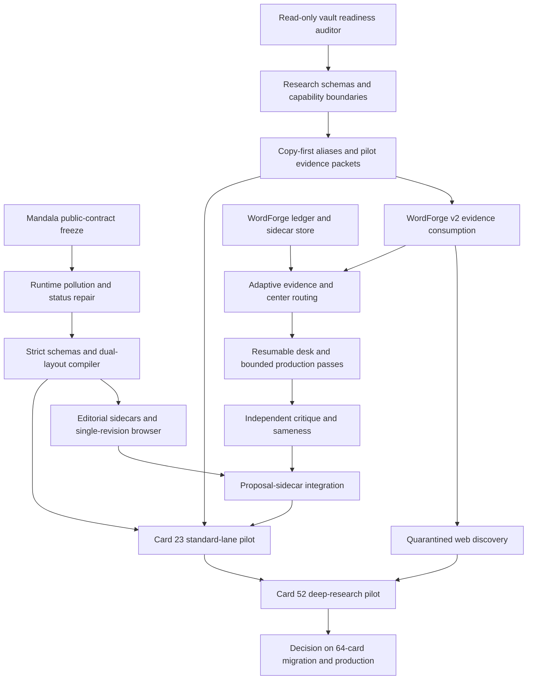

# Oracle Editorial Lifecycle Program Implementation Plan

> **For agentic workers:** REQUIRED SUB-SKILL: Use superpowers:subagent-driven-development (recommended) or superpowers:executing-plans to implement this plan task-by-task. Steps use checkbox (`- [ ]`) syntax for tracking.

**Goal:** Deliver the research, editorial, and publication framework for two Oracle pilot cards without beginning a deck-wide writing pass.

**Architecture:** Obsidian remains research truth, WordForge becomes a resumable production and review desk, and Mandala per-lens Markdown becomes publication truth behind one canonical compiler. Three subsystem plans can be implemented independently until explicit integration gates; Card 23 proves the standard path and Card 52 proves the deep-research path.

**Tech Stack:** Markdown/YAML, TypeScript, Node.js, Vite, Vitest, Playwright, SQLite, SHA-256, Git worktrees, Obsidian, i64 OS WordForge.

---

## Program documents

- Design authority: `docs/superpowers/specs/2026-08-10-oracle-editorial-lifecycle-design.md`
- Web-ingestion policy: `docs/research/2026-08-10-oracle-web-ingestion-provenance.md`
- Mandala compiler plan: `docs/superpowers/plans/2026-08-10-oracle-manuscript-compiler.md`
- Research and evidence plan: `docs/superpowers/plans/2026-08-10-oracle-research-evidence-foundation.md`
- WordForge desk plan: `docs/superpowers/plans/2026-08-10-oracle-wordforge-editorial-desk.md`

The three subsystem plans are independently executable. This document owns their order, integration gates, and pilot acceptance. It does not replace their file-level test-driven steps.

## Design coverage

| Approved requirement | Implemented by |
| --- | --- |
| Obsidian research authority and physical zones | Research plan Tasks 2–5 |
| Stable source versions, evidence atoms, rights, and provenance | Research plan Tasks 1, 3, 4, and 7 |
| Gap-driven, quarantined web discovery | Research plan Task 7 |
| Per-lens Mandala Markdown and one canonical compiler | Mandala plan Tasks 4, 5, 7, and 8 |
| Internal-status removal and runtime preflight repairs | Mandala plan Tasks 1–3 and 6 |
| Durable editorial sidecars outside the database | Mandala plan Task 6 and WordForge plan Tasks 2 and 8 |
| Independent status dimensions and adaptive lanes | WordForge plan Tasks 1 and 3 |
| One resumable WordForge desk | WordForge plan Tasks 4 and 7 |
| One bounded writer/humanizer sequence with no rewrite loop | WordForge plan Task 5 and this program Task 6 |
| Independent critic and whole-card/deck sameness | WordForge plan Task 6 |
| Human center, finality, and proposal gates | WordForge plan Tasks 4, 8, and 9 |
| Browser/REST/search/MCP compatibility | Mandala plan Tasks 1, 5, 7, 8, and 10 |
| Card 23 standard and Card 52 deep pilots | All three subsystem pilot tasks and this program Tasks 8–9 |
| Safe rollback and no live operations | Each subsystem's final task and this program rollback section |

## Locked program rules

- No task in this program authorizes new Oracle prose.
- Additional time is spent on research, provenance, contradictions, and the human-approved center—not repeated writing passes.
- Foundational production uses the standard lane. Fast is reserved for later maintenance of unchanged, human-approved material.
- No automatic rewrite loop exists. Critique reports findings; one bounded revision suggestion requires a human request.
- Discovery cannot write source records, evidence packets, WordForge prose, or Mandala manuscripts.
- AI and plugins cannot promote finality.
- No implementation task may push, open a pull request, merge, deploy, or change production data.
- Existing browser, REST, search, hosted MCP, and local MCP behavior stays compatible unless an explicitly tested cleanup removes an accidentally public internal field.
- Existing dirty-worktree content belongs to the operator. Use isolated worktrees at execution time and never absorb unrelated changes.

## Dependency map



## Parallel delivery boundaries

The first three work packets can proceed in parallel because they touch different repositories or files:

1. Mandala public-contract freeze and urgent runtime protection.
2. Read-only Obsidian readiness auditing implemented in i64 OS.
3. WordForge editorial ledger and pending-sidecar persistence.

They meet only at reviewed contracts. Do not let agents concurrently edit the shared Oracle lifecycle specification, the same package manifest, the same migration number, or the same publication adapter.

## Task 1: Capture reproducible baselines

**Files:**

- Read: `oracle/INDEX.md`
- Read: `docs/superpowers/specs/2026-08-10-oracle-editorial-lifecycle-design.md`
- Read: `/Users/adrianrasmussen/Documents/Files/2 Areas/Coding/i64os/docs/ORACLE_SYSTEM_INDEX.md`
- Do not modify operator-owned dirty files.

- [ ] **Step 1: Record Mandala worktree state**

Run:

```bash
cd "/Users/adrianrasmussen/Documents/Files/2 Areas/Coding/mandalacodes"
git status --short
```

Expected: record all existing modifications before creating an isolated implementation worktree. At design time, root `INDEX.md` was already modified and must not be absorbed.

- [ ] **Step 2: Record i64 OS worktree state**

Run:

```bash
cd "/Users/adrianrasmussen/Documents/Files/2 Areas/Coding/i64os"
git status --short
```

Expected: record all existing modifications and untracked research before creating an isolated implementation worktree.

- [ ] **Step 3: Verify the existing Mandala runtime baseline**

Run:

```bash
cd "/Users/adrianrasmussen/Documents/Files/2 Areas/Coding/mandalacodes"
npx vitest run \
  tests/unit/cardMarkdown.test.ts \
  tests/unit/oracleRelationsSource.test.ts \
  tests/unit/oracleBrowserSource.test.ts \
  tests/unit/oracleCorpus.test.ts \
  tests/unit/oracleArtifacts.test.ts \
  tests/unit/oracleHostedApi.test.ts \
  tests/unit/oracleHostedTools.test.ts
```

Expected: 44 focused tests pass before changing the compiler boundary.

- [ ] **Step 4: Verify existing i64 Oracle mechanics**

Run:

```bash
cd "/Users/adrianrasmussen/Documents/Files/2 Areas/Coding/i64os"
npx vitest run \
  apps/core/__vitest__/wordforge-oracle-card-file.test.ts \
  apps/core/__vitest__/wordforge-oracle-series-import.test.ts \
  apps/core/__vitest__/wordforge-oracle-assimilation-store.test.ts \
  apps/core/__vitest__/wordforge-oracle-production.test.ts \
  apps/core/__vitest__/wordforge-oracle-publish.test.ts
```

Expected: existing text preservation, synchronization, assimilation, review binding, and isolated publication tests pass.

- [ ] **Step 5: Commit no baseline artifacts**

The baseline task is read-only. Do not commit logs, generated JSON, database files, temporary vault reports, or dependency installations.

## Task 2: Land the two fail-closed foundations

**Files:**

- Follow Mandala compiler plan through its public-contract and urgent-preflight tasks.
- Follow research/evidence plan through its read-only vault-auditor task.

- [ ] **Step 1: Implement Mandala runtime protection in its own worktree**

Complete the public-contract freeze, numbered-only browser source boundary, noncanonical-file archival, public-status removal, and strict status validation described in `2026-08-10-oracle-manuscript-compiler.md`.

Expected: all 64 cards still compile, public artifacts contain no internal status, and the browser cannot bundle a noncanonical manuscript.

- [ ] **Step 2: Implement the read-only readiness auditor in an i64 OS worktree**

Complete the auditor task in `2026-08-10-oracle-research-evidence-foundation.md` without moving or rewriting a vault file.

Expected: the deterministic report identifies bodyless linked sources, missing provenance, duplicate bodies, broken/ambiguous links, and readiness by card/lens.

- [ ] **Step 3: Prove the critical Card 52 correction**

Run:

```bash
cd "/Users/adrianrasmussen/Documents/Files/2 Areas/Coding/i64os"
ORACLE_VAULT_ROOT="/Users/adrianrasmussen/Documents/Obsidian Vault/oracle" \
  npm run audit:oracle-vault -- --check
```

Expected: the command exits nonzero for full-corpus readiness and names Card 52 BODY gaps. It must not report all 64 cards ready merely because linked paths exist.

- [ ] **Step 4: Stop if the auditor remains permissive**

Do not create v2 source records, move files, enable web discovery, or connect WordForge to the new layout until the Card 52 assertion passes.

## Task 3: Establish versioned contracts

**Files:**

- Mandala: compiler schema and editorial-sidecar codec files listed in `2026-08-10-oracle-manuscript-compiler.md`
- Obsidian: `00-system/` schema and workflow files listed in `2026-08-10-oracle-research-evidence-foundation.md`
- i64 OS: editorial ledger, sidecar, and status files listed in `2026-08-10-oracle-wordforge-editorial-desk.md`

- [ ] **Step 1: Freeze schema identifiers**

Use these identifiers consistently:

```text
oracle-card/v2
oracle-lens/v1
oracle-editorial/v1
oracle.source-version.v1
oracle.evidence-bundle.v1
oracle.intake-candidate.v1
```

Expected: every parser rejects unsupported versions rather than treating them as the newest format.

- [ ] **Step 2: Align digest vocabulary**

All cross-system references use lowercase hexadecimal SHA-256 over exact UTF-8 bytes. Field names end in `_sha256`; Markdown presentation may prefix values with `sha256:` only when the codec strips and validates that prefix consistently.

Expected: one shared fixture round-trips between Obsidian evidence, WordForge artifacts, and Mandala sidecars without renaming a digest field.

- [ ] **Step 3: Align status ownership**

Research readiness, human judgment, draft state, humanizer, critique, sameness, editorial finality, synchronization, and proposal status remain independent. Public `CanonicalCard` contains none of them.

Expected: contract tests recursively reject `status`, `meta`, sourcing logs, fact-check notes, and editorial findings in public output.

- [ ] **Step 4: Review contracts before integration work**

Compare the three subsystem fixtures in one review. If field names, schema versions, lens keys, card padding, or digest rules disagree, correct the plans and codecs before adding adapters.

## Task 4: Build independently testable subsystem cores

**Files:**

- Follow the strict-schema, pure-compiler, and ring-normalization tasks in the Mandala plan.
- Follow the schema, alias, and pilot-packet tasks in the research plan.
- Follow the ledger, sidecar, and status-engine tasks in the WordForge plan.

- [ ] **Step 1: Complete the Mandala dual-layout compiler**

Expected: legacy `oracle/cards/NN.md` and v2 `oracle/manuscripts/NN/` can produce the same canonical result, but the compiler rejects two active layouts for one card and never falls back from an incomplete v2 bundle.

- [ ] **Step 2: Complete copy-first research normalization for pilot material**

Expected: legacy files remain recoverable, canonical source versions have stable identities and hashes, aliases are acyclic and unambiguous, and duplicates are candidates rather than silently merged.

- [ ] **Step 3: Complete the WordForge ledger and pending-sidecar store**

Expected: work items resume by optimistic version, artifacts are append-only, pending Markdown receipts recover after interruption, and no database state becomes canonical prose.

- [ ] **Step 4: Run subsystem-focused typechecks and tests**

Run every focused command from the three subsystem plans. Do not substitute a full-suite pass for a missing contract test.

## Task 5: Connect evidence and the editorial desk

**Files:**

- i64 OS source manifest, reader, assimilation, editorial evidence, center, model, and desk modules listed in the research and WordForge plans.

- [ ] **Step 1: Add the v2 research-layout feature flag**

Expected: `ORACLE_RESEARCH_LAYOUT=v2` activates stable source/evidence identity for selected pilot packets only. Legacy resolution remains available during migration but is never labeled v2-ready.

- [ ] **Step 2: Derive lanes server-side**

Expected routing:

```text
deep     = incomplete/conflicted/stale/unavailable/invalid evidence or blocking similarity
fast     = later maintenance with unchanged approved center and no gaps
standard = every other foundational work item
```

Foundational pilot work must never derive `fast`.

- [ ] **Step 3: Expose one resumable desk seam**

Expected: callers can open a card/lens and execute only server-issued action tokens. They cannot submit paths, transition names, hashes, model identities, or finality state.

- [ ] **Step 4: Preserve all existing routes during the pilot**

The new editorial routes are additive. Existing assimilation, review, synchronization, and proposal routes remain operational until the pilot proves equivalent protections.

## Task 6: Add bounded writing and quality machinery

**Files:**

- Follow the model, humanizer, checks, sameness, and desk orchestration tasks in the WordForge plan.

- [ ] **Step 1: Enforce role separation**

Expected: the evidence/center model cannot emit card prose; the writer creates the candidate; the humanizer returns bounded patches; and a critic in the writer's provider/model family cannot persist a passing verdict.

- [ ] **Step 2: Enforce humanizer constraints**

Expected: stale, overlapping, out-of-range, claim-adding, heading-changing, quote-changing, number-changing, and protected-term-changing patches fail as a unit while preserving the writer candidate.

- [ ] **Step 3: Add deterministic checks before semantic checks**

Expected: fixed frames, repeated openings, five- to eight-word shingles, repeated imagery, and cross-lens leakage are reported with exact spans before optional embedding/model interpretation runs.

- [ ] **Step 4: Forbid automatic rewrite loops**

Critique and sameness return findings. After a human edit, WordForge reruns invalidated checks but does not invoke writer or humanizer. One bounded AI revision suggestion is available only through an explicit human action.

## Task 7: Integrate publication sidecars and v2 paths

**Files:**

- Mandala editorial-sidecar codec and v2 compiler adapters.
- i64 OS Oracle publication service and publisher internals.

- [ ] **Step 1: Make Mandala validate sidecars without consuming them as prose**

Expected: sidecars validate card, lens, schema, manuscript digest, finality, and fixed body sections. They cannot refill a manuscript or enter public output.

- [ ] **Step 2: Extend the internal publisher only**

Expected: legacy HTTP callers retain their request shape. Server-derived sidecar bytes and paths may be added internally; callers never supply repository paths.

- [ ] **Step 3: Expand the isolated-worktree allowlist narrowly**

Expected: a proposal may contain the selected card's v2 manuscript files, exact derived editorial sidecars, and deterministic generated artifacts. It may not change another card, shared checkout, source vault, configuration, or unrelated documentation.

- [ ] **Step 4: Preserve the remote-action stop**

Expected: proposal returns a local branch and commit with `requires_approval: true` and `remote_actions_performed: false`. It never pushes, opens a pull request, merges, or deploys.

## Task 8: Run the Card 23 standard-lane pilot

**Files:**

- Obsidian: `30-cards/23/` and `40-work/23/CODE/`
- Mandala: proposed `oracle/manuscripts/23/` and `oracle/editorial/23/`
- WordForge: one Card 23 CODE work item and append-only artifacts

- [ ] **Step 1: Prepare Card 23 evidence without prose generation**

Expected: all evidence atoms resolve to stable source versions and locators; any correlation conflict remains explicit rather than smoothed over.

- [ ] **Step 2: Approve a pilot center in a disposable environment**

Use a named test editor and fixture data. This proves the state transition and sidecar lineage; it is not authorization to replace the production card center.

- [ ] **Step 3: Run the bounded production sequence with test adapters**

Expected: writer candidate, humanizer patches, mechanical checks, independent critique, whole-card/deck sameness, human-edit invalidation, exact finality, and resume behavior all pass in the integration fixture.

- [ ] **Step 4: Run the v2 migration check without writing**

Run:

```bash
cd "/Users/adrianrasmussen/Documents/Files/2 Areas/Coding/mandalacodes"
npx tsx scripts/migrate-oracle-card.ts --card 23 --check
```

Expected: legacy and proposed v2 canonical cards, search documents, and lens-body hashes are identical; no filesystem change occurs.

- [ ] **Step 5: Prepare one local proposal in fixtures**

Expected: the isolated proposal contains only Card 23 v2 files, Card 23 sidecars, and deterministic artifacts. The shared checkout remains byte-identical.

- [ ] **Step 6: Stop for human pilot review**

Do not apply the real Card 23 migration or process another card until the source packet, center screen, candidate comparison, findings, rendered page, sidecars, and local proposal diff have been reviewed together.

## Task 9: Run the Card 52 deep-research pilot

**Files:**

- Obsidian: `30-cards/52/`, `40-work/52/BODY/`, and `40-work/52/CODE/`
- WordForge: Card 52 BODY and CODE deep-lane work items
- Mandala: no canonical Card 52 change until evidence and editorial gates pass

- [ ] **Step 1: Confirm deep routing from real gaps**

Expected: bodyless or unsupported required inputs make BODY and dependent CODE ineligible for writing and identify named gaps.

- [ ] **Step 2: Exercise quarantined discovery with fake network adapters**

Expected: candidates remain under intake, access and persistence permissions are separate, and no candidate satisfies readiness before human promotion and source-map update.

- [ ] **Step 3: Exercise human disposition and evidence refresh in fixtures**

Expected: accepted source versions receive stable identity, rights basis, locator, and digests; rejected candidates remain non-publishable and cannot enter the evidence bundle.

- [ ] **Step 4: Continue from deep to standard without rebuilding valid work**

Expected: after gaps are genuinely resolved, WordForge preserves valid artifacts, invalidates only dependent state, and reaches center review. It does not add writing passes because research took longer.

- [ ] **Step 5: Stop before real Card 52 prose generation**

The framework pilot proves routing and readiness. Beginning an actual Card 52 rewrite requires a separate editorial authorization.

## Task 10: Run the integrated proving suite

**Files:**

- No source modifications during this task except deterministic artifacts explicitly regenerated by the subsystem plans.

- [ ] **Step 1: Verify Mandala**

Run:

```bash
cd "/Users/adrianrasmussen/Documents/Files/2 Areas/Coding/mandalacodes"
npm run typecheck
npm --prefix mcp/oracle-server run typecheck
npm run test:unit -- \
  tests/unit/cardMarkdown.test.ts \
  tests/unit/oracleCompiler.test.ts \
  tests/unit/oracleEditorialSidecar.test.ts \
  tests/unit/oracleManuscriptMigration.test.ts \
  tests/unit/oracleCorpus.test.ts \
  tests/unit/oracleArtifacts.test.ts \
  tests/unit/oracleHostedApi.test.ts \
  tests/unit/oracleHostedTools.test.ts
npm run build
```

Expected: all commands pass and generated artifacts are deterministic.

- [ ] **Step 2: Verify research and WordForge**

Run the exact focused Vitest, migration, typecheck, and Playwright commands from both i64 OS subsystem plans.

Expected: Card 23 is standard-ready in fixtures; Card 52 is deep until named evidence gaps are resolved; sidecars and work items resume after simulated interruption.

- [ ] **Step 3: Inspect public output recursively**

Expected: browser, corpus JSON, search JSON, REST, hosted MCP, and local MCP contain no internal statuses, editorial receipts, evidence metadata, sourcing logs, fact-check notes, absolute paths, or model/plugin identities.

- [ ] **Step 4: Inspect real rendered Card 23**

Open the actual Oracle reader at desktop and mobile widths using the v2 fixture or isolated proposal build.

Expected: structural data and prose come from the same compiled revision; malformed authoring data shows a visible controlled error instead of blank prose.

- [ ] **Step 5: Record local versus production verification**

The program completion report must say which repositories, branches, fixture databases, vault roots, generated artifacts, and local pages were tested. It must not imply deployment or live verification.

## Task 11: Make the scale decision

**Files:**

- Update the program plan or create a separate 64-card migration plan only after pilot review.

- [ ] **Step 1: Review evidence quality**

Confirm the Card 23 packet is reconstructable and the Card 52 gap path correctly refuses shallow completion.

- [ ] **Step 2: Review editorial quality mechanics**

Confirm one bounded writer/humanizer sequence, independent critique, exact sameness spans, human-edit preservation, and finality behavior.

- [ ] **Step 3: Review operational safety**

Confirm capability boundaries, optimistic concurrency, interruption recovery, isolated proposal behavior, deterministic builds, and rollback.

- [ ] **Step 4: Choose the next program deliberately**

Only then choose among:

```text
continue research normalization without writing
migrate remaining manuscripts mechanically without rewriting prose
begin a separately authorized editorial production program
pause and revise the framework
```

Do not infer deck-wide writing authority from successful infrastructure pilots.

## Rollback boundaries

- Mandala preflight changes are independent and should remain even if the wider program pauses.
- The legacy manuscript adapter remains until all 64 cards migrate.
- One active layout per card is enforced; reverting a migrated card restores its legacy file and removes its active v2 directory in one commit.
- Research normalization is copy-first. Legacy files are not deleted; aliases can point consumers back during rollback.
- `ORACLE_RESEARCH_LAYOUT=v2` scopes research-layout activation to pilot consumers.
- WordForge routes are additive during the pilot; existing production panels and routes remain available.
- Pending WordForge sidecars live in managed storage until proposal authorization; a failed proposal cannot mutate Mandala.
- A migration or sidecar failure never authorizes prose fallback, silent conflict resolution, or status promotion.

## Completion definition

This program is complete when:

- the three subsystem plans are implemented and verified;
- Card 23 proves the standard framework path in an isolated pilot;
- Card 52 proves the deep-research path and honest gap handling;
- accepted judgments survive in Markdown sidecars;
- the website and all Oracle transports consume one compiled card revision;
- no real Oracle prose has been rewritten without separate authorization; and
- a human has reviewed the pilot evidence, interface, rendered card, and isolated proposal before any scale decision.
